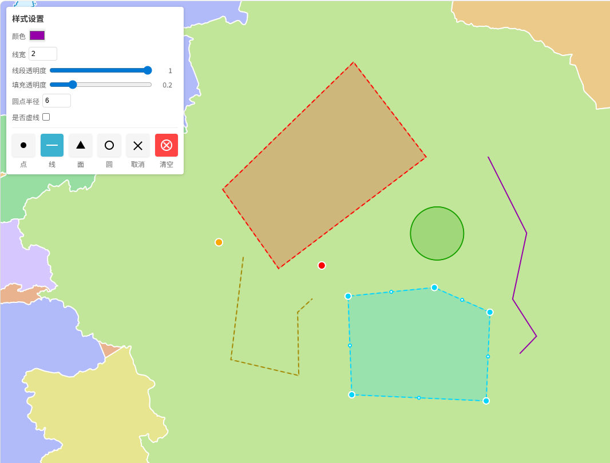

# MapLibre Draw Editor

基于 MapLibre GL JS 实现的绘制和编辑工具，支持绘制点、线、面、圆等几何要素，并提供编辑功能。

## 功能特性

- ✅ 绘制点、线、面、圆等几何要素
- ✅ 要素编辑：选择、移动、顶点拖拽、删除
- ✅ 顶点间中点交互，支持插入新顶点
- ✅ 鼠标悬停效果和拖拽反馈
- ✅ 事件回调机制，支持要素选中、拖拽、变化等事件
- ✅ 支持自定义样式和图层配置
- ✅ 每个要素可以设置不同的样式
- ✅ 右键删除功能，带删除确认按钮
- ✅ 轻量级实现，仅依赖 MapLibre GL JS

## 截图

<br />

## 安装

### NPM 安装

```bash
npm install maplibre-draw-editor
# 或
yarn add maplibre-draw-editor
# 或
pnpm add maplibre-draw-editor
```

## 基本用法

### 初始化及事件监听

```javascript
import MapLibreDraw, { DrawMode } from 'maplibre-draw-editor';

// 初始化地图
const map = new maplibregl.Map({
  container: 'map',
  style: 'https://demotiles.maplibre.org/style.json',
  center: [116.397428, 39.90923],
  zoom: 12
});

// 初始化绘制工具
const draw = new MapLibreDraw({
  map: map,
  primaryColor: '#ffa600', // 自定义颜色
  onFeatureSelect: (feature) => {
    console.log('要素选中:', feature);
  },
  onFeatureChange: (feature) => {
    console.log('要素变化:', feature);
  },
  onDrawEnd: (feature) => {
    console.log('绘制结束:', feature);
  }
});
```

### 模式切换

```javascript
// 设置绘制模式
draw.setMode(DrawMode.POINT); // 点绘制模式
// draw.setMode(DrawMode.LINE); // 线绘制模式
// draw.setMode(DrawMode.POLYGON); // 面绘制模式
// draw.setMode(DrawMode.CIRCLE); // 圆绘制模式
// draw.setMode(DrawMode.SELECT); // 选择模式
// draw.setMode(DrawMode.NONE); // 取消绘制模式
```

### 带样式的模式切换

```javascript
// 设置绘制模式并指定样式
draw.setMode(DrawMode.LINE, {
  primaryColor: '#ff0000',
  lineWidth: 3,
  dashed: true,
});

// 设置绘制模式并指定实线样式
draw.setMode(DrawMode.POLYGON, {
  primaryColor: '#00ff00',
  lineWidth: 4,
  fillOpacity: 0.3,
  dashed: false
});
```

### 绘制模式说明

```typescript
export const DrawMode = {
  NONE: 'none',     // 无绘制模式
  POINT: 'point',   // 点绘制模式
  LINE: 'line',     // 线绘制模式
  POLYGON: 'polygon', // 面绘制模式
  CIRCLE: 'circle', // 圆绘制模式
  SELECT: 'select'  // 选择模式
};
```

### 要素编辑

```javascript
// 主动选中指定要素
draw.selectFeatureById('feature-id');

// 向要素集合中添加新要素
const newFeature = {
  type: 'Feature',
  geometry: {
    type: 'Point',
    coordinates: [116.397428, 39.90923]
  },
  properties: {}
};
draw.addFeature(newFeature);

// 删除指定要素
draw.removeFeatureById('feature-id');
```

### 清空要素

```javascript
// 清除所有要素
draw.clear();

// 获取所有要素
const features = draw.getFeatures();
```

## 配置选项

### DrawOptions

| 参数                   | 类型                       | 必填 | 默认值       | 说明                   |
| -------------------- | ------------------------ | -- | --------- | -------------------- |
| map                  | any                      | 是  | -         | MapLibre GL JS 地图实例  |
| primaryColor         | string                   | 否  | '#ffa600' | 主要颜色，用于绘制要素和顶点       |
| enableDeleteConfirmation | boolean                | 否  | false     | 是否启用删除确认按钮           |
| onFeatureSelect      | (feature: any) => void   | 否  | -         | 要素选中时触发              |
| onDragStart          | (feature: any) => void   | 否  | -         | 开始拖拽要素或顶点时触发         |
| onFeatureChange      | (feature: any) => void   | 否  | -         | 要素坐标发生变化时触发（包括绘制过程中） |
| onDragEnd            | (feature: any) => void   | 否  | -         | 结束拖拽要素或顶点时触发         |
| onDrawEnd            | (feature: any) => void   | 否  | -         | 完成绘制时触发              |
| onModeChange         | (mode: DrawMode) => void | 否  | -         | 绘制模式改变时触发            |

### 样式选项 (StyleOptions)

| 参数          | 类型       | 必填 | 默认值    | 说明                   |
| ----------- | -------- | -- | ------ | -------------------- |
| primaryColor | string   | 否  | '#ffa600' | 主要颜色                 |
| lineWidth   | number   | 否  | 2      | 线宽                   |
| lineOpacity | number   | 否  | 1      | 线透明度                 |
| fillOpacity | number   | 否  | 0.2    | 填充透明度                |
| circleRadius | number   | 否  | 6      | 圆点半径                 |
| dashed      | boolean  | 否  | false  | 是否虚线                 |

## 方法

| 方法                                   | 参数                    | 返回值                | 说明             |
| ------------------------------------ | --------------------- | ------------------ | -------------- |
| setMode(mode: DrawMode, style?: StyleOptions) | mode: 绘制模式, style: 样式选项（可选） | 无                  | 设置绘制模式和样式      |
| getMode()                            | 无                     | DrawMode           | 获取当前绘制模式       |
| getFeatures()                        | 无                     | GeoJSON.Feature\[] | 获取所有绘制的要素      |
| clear()                              | 无                     | 无                  | 清除所有绘制的要素      |
| removeFeatureById(featureId: string) | featureId: 要素ID       | boolean            | 删除指定的要素        |
| selectFeatureById(featureId: string) | featureId: 要素ID       | boolean            | 选中指定的要素，进入编辑状态 |
| addFeature(feature: GeoJSON.Feature) | feature: 要添加的要素      | GeoJSON.Feature    | 向要素集合中添加新的要素   |

## 事件回调

### onFeatureSelect

- **触发时机**：要素被选中时
- **参数**：`feature` - 被选中的要素

### onDragStart

- **触发时机**：开始拖拽要素或顶点时
- **参数**：`feature` - 被拖拽的要素

### onFeatureChange

- **触发时机**：要素坐标发生变化时（包括绘制过程中）
- **参数**：`feature` - 变化后的要素

### onDragEnd

- **触发时机**：结束拖拽要素或顶点时
- **参数**：`feature` - 拖拽后的要素

### onDrawEnd

- **触发时机**：完成绘制时
- **参数**：`feature` - 绘制完成的要素

### onModeChange

- **触发时机**：绘制模式改变时
- **参数**：`mode` - 新的绘制模式

## 完整示例

### 基本用法

```javascript
import maplibregl from 'maplibre-gl';
import 'maplibre-gl/dist/maplibre-gl.css';
import MapLibreDraw, { DrawMode } from 'maplibre-draw-editor';

// 初始化地图
const map = new maplibregl.Map({
  container: 'map',
  style: 'https://demotiles.maplibre.org/style.json',
  center: [116.397428, 39.90923],
  zoom: 12
});

// 初始化绘制工具
const draw = new MapLibreDraw({
  map: map,
  primaryColor: '#ffa600',
  enableDeleteConfirmation: true, // 启用删除确认按钮
  onFeatureSelect: (feature) => {
    console.log('要素选中:', feature);
  },
  onFeatureChange: (feature) => {
    console.log('要素变化:', feature);
  },
  onDrawEnd: (feature) => {
    console.log('绘制结束:', feature);
  }
});

// 模式切换按钮
 document.getElementById('btn-point').addEventListener('click', () => {
  draw.setMode(DrawMode.POINT);
});

document.getElementById('btn-line').addEventListener('click', () => {
  draw.setMode(DrawMode.LINE, {
    primaryColor: '#ff0000',
    lineWidth: 3,
    dashed: true,
  });
});

document.getElementById('btn-polygon').addEventListener('click', () => {
  draw.setMode(DrawMode.POLYGON, {
    primaryColor: '#00ff00',
    lineWidth: 4,
    fillOpacity: 0.3
  });
});

document.getElementById('btn-circle').addEventListener('click', () => {
  draw.setMode(DrawMode.CIRCLE, {
    primaryColor: '#0000ff',
    lineWidth: 2
  });
});

document.getElementById('btn-select').addEventListener('click', () => {
  draw.setMode(DrawMode.SELECT);
});

document.getElementById('btn-clear').addEventListener('click', () => {
  draw.clear();
});
```

### 使用 MapLibreDrawControl 控件

```javascript
import maplibregl from 'maplibre-gl';
import 'maplibre-gl/dist/maplibre-gl.css';
import MapLibreDraw, { DrawMode, MapLibreDrawControl } from 'maplibre-draw-editor';

// 初始化地图
const map = new maplibregl.Map({
  container: 'map',
  style: 'https://demotiles.maplibre.org/style.json',
  center: [116.397428, 39.90923],
  zoom: 12
});

// 初始化绘制工具
const draw = new MapLibreDraw({
  map: map,
  primaryColor: '#ffa600',
  enableDeleteConfirmation: true
});

// 创建并添加绘制控件
const drawControl = new MapLibreDrawControl(draw);
map.addControl(drawControl, 'top-right');
```

## 注意事项

1. **地图加载**：确保在地图加载完成后初始化绘制工具，或使用地图的 `load` 事件回调初始化。
2. **性能优化**：对于大量要素的场景，建议合理使用 `clear()` 方法清理不需要的要素，避免性能问题。
3. **样式冲突**：如果地图中已有同名图层，可能会导致样式冲突，请确保使用唯一的图层ID。
4. **事件处理**：绘制工具会监听地图的鼠标事件，可能与其他地图交互产生冲突，如需自定义交互，请谨慎处理。
5. **坐标精度**：由于地图投影和坐标转换的原因，可能会存在微小的坐标精度误差，这是正常现象。
6. **样式设置**：每个要素可以设置不同的样式，通过 `setMode` 方法的第二个参数传递样式选项。
7. **删除确认**：启用 `enableDeleteConfirmation` 后，右键点击要素会显示删除确认按钮，点击确认后才会删除要素。

## 作者

wou

邮箱：<935148942@qq.com>

## 许可证

MIT

## 贡献

欢迎提交 Issue 和 Pull Request！
